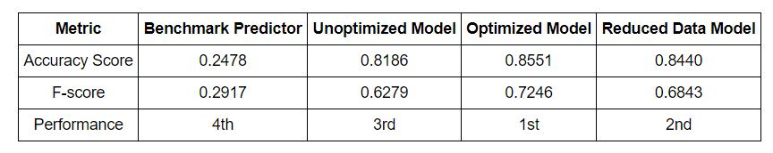

# Finding Donors for Charity
Language: Python (scikit-learn, pandas, NumPy)   
Skills: Machine Learning, Data Exploration, Data Visualization  
Compared the accuracy of the SVM, Decision Tree and Naïve Bayes models on distinguishing potential donors. Optimized the model with GridSearchCV and preformed features selection to reduce training time.

  

  

